# Advanced Search Strategy and Flow

This document explains the implemented GraphRAG advanced-search system end to end: readiness and admission, bounded AI planning, parallel text and optional graph retrieval, fusion and reranking, evidence sufficiency, one optional follow-up round, cited answer synthesis, durable lifecycle management, and the frontend operator workflow. It was verified against both repositories and the running applications on 2026-08-07.

For exact API shapes, settings, state semantics, result fields, diagnostics, observed examples, and implementation locations, see [Advanced Search Reference](reference.md).

## Executive summary

- Advanced Search is the current durable evidence-grounded search workflow. The former hybrid-search UI and endpoint are no longer exposed; a small set of old hybrid setting names remains only for compatibility.
- A submission is a retained run, not a blocking request. The backend returns HTTP 202, executes asynchronously, persists lifecycle and result data, and exposes polling, result, cancellation, and history resources.
- Readiness blocks only unsafe provider or embedding states. No schema and an empty corpus are informational: text-only or insufficient-evidence outcomes remain valid.
- The planner can produce up to three text subqueries, bounded exact terms and metadata filters, and up to two schema-validated graph plans. If planning fails, the workflow falls back to a safe text plan.
- Every text round runs dense, lexical, and metadata branches concurrently. Typed graph plans run separately and only when an active schema snapshot is available.
- Results are deduplicated and fused with reciprocal-rank fusion, enriched with graph and parent context, AI-reranked, and diversity-limited to at most three evidence items per document.
- A sufficiency pass may authorize one follow-up text round with at most two refinements. Time is reserved for final synthesis.
- The synthesizer can publish only validated, catalog-backed claims. Invalid model output receives one bounded repair attempt; otherwise the system abstains and preserves evidence plus diagnostics.
- Only `COMPLETED` and `PARTIAL` runs expose a result. `FAILED`, `CANCELLED`, and `INTERRUPTED` remain inspectable lifecycle records without result handoff.

## Where Advanced Search fits

The Queries page contains four synchronous controller workflows: Ask, Generate Cypher, Validate Cypher, and Execute Cypher. Advanced Search is a separate page and contract for questions that need durable execution, multiple retrieval channels, ranked source evidence, typed citations, answer validation, diagnostics, cancellation, and retained history.

| Need | Use |
| --- | --- |
| One-shot generated graph query and execution | Queries > Ask |
| Inspect or operate on Cypher directly | Queries > Generate, Validate, or Execute |
| Evidence-grounded answer across chunk text, metadata, and optional graph facts | Advanced Search |
| Durable monitoring, cancellation, history, partial results, or branch diagnostics | Advanced Search |

The old `hybrid-search` tab is deliberately absent from the current Queries page, and the backend has no current hybrid-search controller route. Legacy hybrid setting keys are recognized only to direct operators toward their advanced-search equivalents.

## System architecture

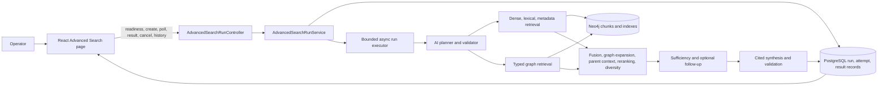

The frontend uses same-origin `/api/v1` routes. The Vite or nginx proxy connects those requests to the backend; no backend contract is duplicated or modified in this repository.

## Readiness and admission

Readiness is deterministic and does not contact an AI provider. It evaluates the selected knowledge base, active AI profile, constructability of chat and embedding clients, stored embedding compatibility, active schema availability, and embedded corpus presence.

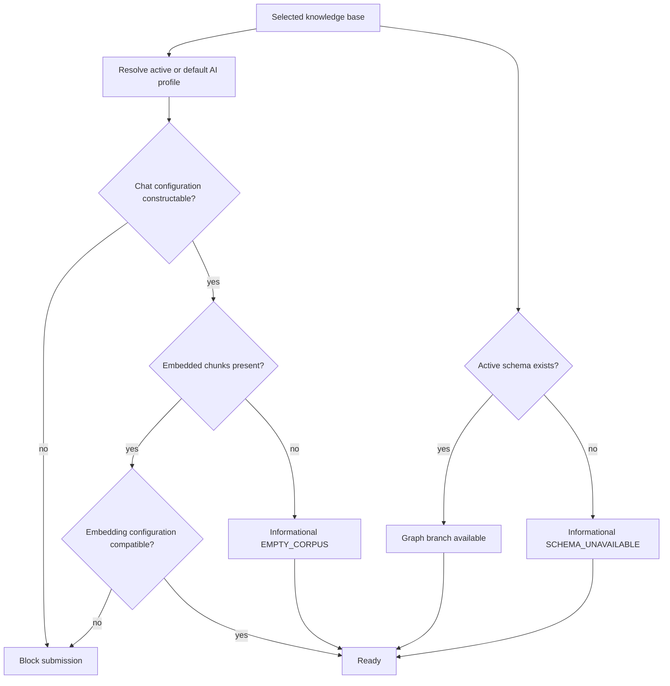

Blocking readiness codes are:

- `PROFILE_UNAVAILABLE`
- `CHAT_CONFIGURATION_UNAVAILABLE`
- `EMBEDDING_CONFIGURATION_UNAVAILABLE`
- `EMBEDDING_SPACE_INCOMPATIBLE`
- `PROFILE_CHANGED`, when the profile changes between the initial check and transactional admission

`SCHEMA_UNAVAILABLE` and `EMPTY_CORPUS` are informational. Missing schema disables graph plans but leaves text retrieval available. An empty embedded corpus can still produce lexical or metadata evidence, or a safe insufficient-evidence result.

Admission is checked twice: once before reserving capacity and again inside the creation transaction. A fair semaphore reserves `concurrency + queueCapacity` slots. Exhaustion returns HTTP 429 without creating a run. The admitted run snapshots the effective advanced-search settings, AI profile ID and revision, and active schema ID, content hash, and JSON.

The running knowledge base used for screenshots reported profile `default` revision 6, graph available, embedded corpus present, and no blockers.

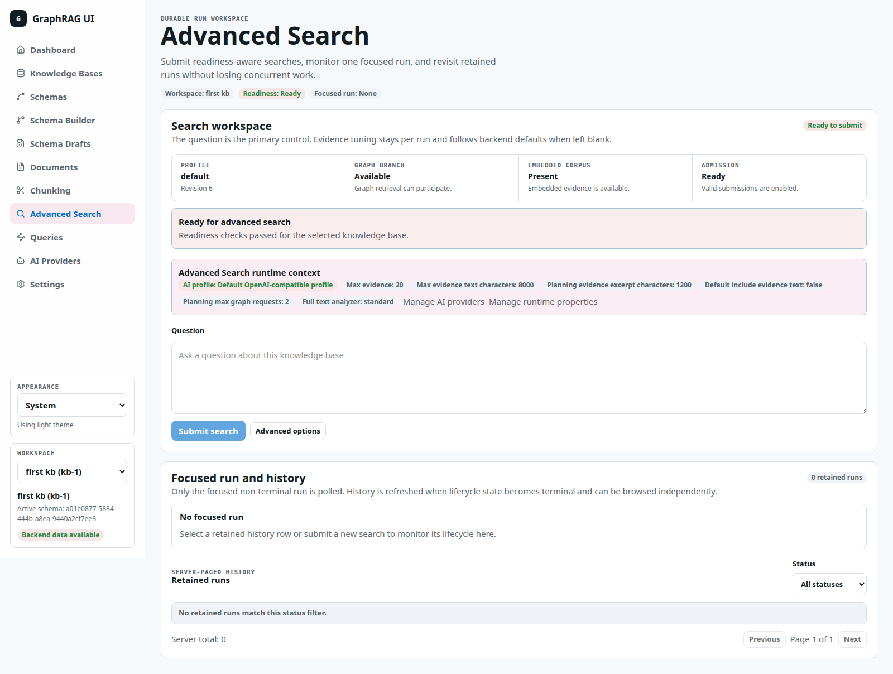

## Operator inputs

The per-run request has three fields:

| Control | Frontend behavior | Backend behavior |
| --- | --- | --- |
| Question | Required, trimmed before submission | Maximum 4,000 characters with current bounds |
| Maximum evidence | Optional integer from 1 through 20 | Blank uses `app.advanced-search.default-evidence`, currently 10 |
| Include evidence text | Checkbox | Controls whether public result evidence/context text is retained, subject to the global text budget |

Maximum evidence is not the number retrieved by each branch. It is the final post-rerank and post-diversity selection target. Each retrieval branch can produce up to the configured candidate limit, currently 60.

The UI exposes the active profile and selected runtime hints beside the form. It preserves the question and options while a focused run changes, so multiple runs can continue server-side.

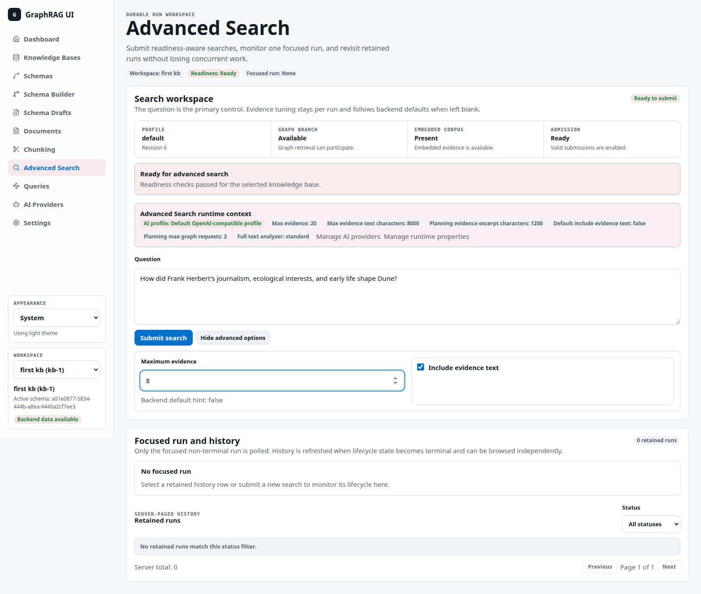

## Planning strategy

The first AI step produces a versioned, bounded retrieval plan. The prompt treats the question and active schema as untrusted data and explicitly rejects Cypher, executable queries, tools, and tool instructions.

The validated plan can contain:

- One to three normalized text subqueries.
- Up to eight exact identifiers or phrases by current default, with a hard validation ceiling of 16.
- Optional filename and content-type constraints.
- Zero to two typed graph requests whose filters, hops, and projections must exist in the snapshotted schema.

Planner output is schema-validated and count/length bounded. A missing chat model or invalid model response produces a safe fallback plan using the original question and no executable graph plan. The result records `fallbackUsed` and `fallbackCategory` in plan diagnostics.

Graph readiness means graph retrieval *may* participate; it does not guarantee a graph attempt. The planner can legitimately emit zero graph plans even when an active schema exists.

## Retrieval branches

Each text round executes three branches concurrently on the bounded branch executor:

| Branch | Input and behavior | Common empty case |
| --- | --- | --- |
| Dense | Embeds every planned subquery with the snapshotted profile and searches the compatible knowledge-base vector index | No embedded chunks |
| Lexical | Compiles every subquery to a safe Lucene query and searches the knowledge-base full-text index | No lexical matches |
| Metadata | Resolves planner-produced filename/content-type filters, then loads owned document chunks | No metadata constraint |
| Graph | Validates typed graph plans, renders server-owned Cypher, executes with a bounded row limit and timeout, and accepts only facts with parent-chunk provenance | No schema or no graph plans |

Dense, lexical, and metadata failures are recorded as branch results rather than automatically failing the whole run. Graph plans execute sequentially because each has its own validated query, but they share the run deadline. Text branches within a round run concurrently.

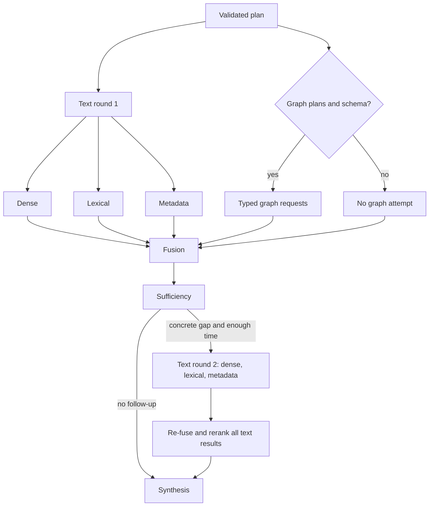

## Ranking and evidence selection

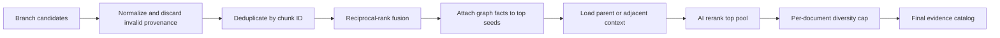

Fusion uses reciprocal-rank fusion with `RRF_K = 60`. Contributions are unique per channel and subquery, and channel contribution is normalized by the number of executed subqueries for that channel:

```text
candidate score += channelWeight / executedSubqueryCount / (60 + rawRank)
```

Current runs use equal channel weights. Candidates are deduplicated by chunk ID, then sorted by fused score. The pool is capped at 60, graph-derived candidates at 20, graph expansion seeds at 10, and the AI rerank pool at 20.

After fusion:

1. Graph expansion attaches supported facts to the highest-ranked chunk seeds.
2. Parent-context expansion loads parent or adjacent context for text-child evidence.
3. The reranker scores the bounded pool from 0.0 to 1.0. Invalid or unavailable reranker output falls back to fused order.
4. Diversity selection keeps the requested maximum while allowing at most three selected items from one document.

Parent and adjacent context are synthesis-only `CTX` entries. Claims cannot cite them. Text evidence receives `E` citation IDs; graph facts retain graph evidence IDs plus supporting parent citations.

## Sufficiency, follow-up, and synthesis

The sufficiency evaluator checks coverage of every plan subquestion, contradictions, and one concrete evidence gap. It may emit at most two refined text queries.

A follow-up round runs only when all conditions are true:

- Cancellation has not been requested.
- The evaluator found a concrete gap.
- Refinements are present.
- Remaining time is at least `followUpMinimumRemaining + synthesisReserve`.

The default reserve calculation is 5 seconds for follow-up admission plus 10 seconds reserved for synthesis. Only one follow-up round exists, and it repeats dense, lexical, and metadata retrieval; graph plans are not rerun.

Final synthesis receives a versioned citation catalog and untrusted document excerpts. Every substantive text claim must cite known `E` identifiers. Graph claims must additionally cite known graph fact and graph evidence IDs. The validator rejects unknown references, unsupported claims, and invalid structured output.

If initial answer validation fails and at least two seconds remain, one repair call is attempted. If repair also fails, the published payload contains no unsupported claims and returns an abstention such as `ANSWER_UNAVAILABLE` or `INSUFFICIENT_EVIDENCE`, while retaining ranked evidence and operator diagnostics.

## Durable lifecycle

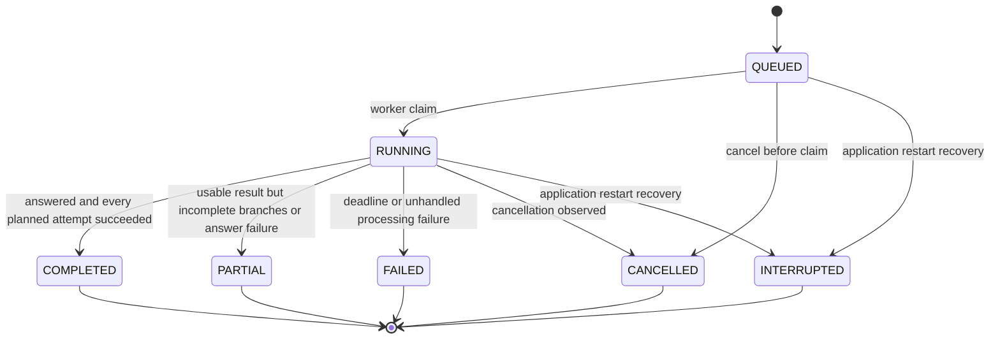

Runtime stage moves independently through:

```text
QUEUED -> RETRIEVAL -> RANKING -> [RETRIEVAL -> RANKING] -> SYNTHESIS -> TERMINAL
```

The bracketed second retrieval/ranking pair exists only when follow-up runs. Terminal status is immutable.

Queued cancellation writes `CANCELLED` immediately and releases admission capacity. Running cancellation records the request and interrupts the local future; branch and synthesis code also checks interruption, cancellation, and the deadline. Cancelling a terminal run is idempotent and returns its canonical state.

Active runs are not resumed after an application restart. Startup maintenance marks them `INTERRUPTED` with `APPLICATION_RESTART`. Terminal runs receive an expiry timestamp and are deleted in bounded cleanup batches. The default retention is 24 hours and cleanup runs every five minutes unless deployment configuration changes it.

## Frontend flow

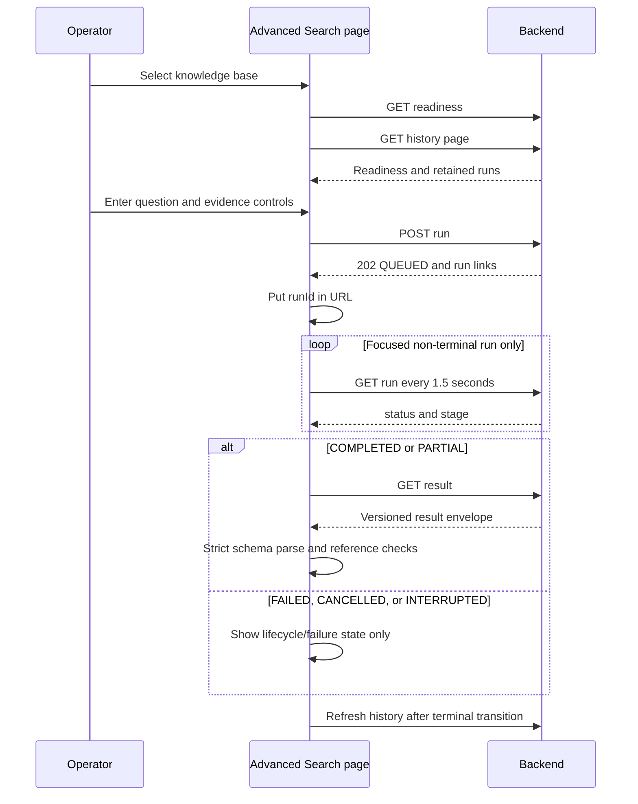

The selected `runId` is URL-addressable as `/advanced-search?runId=...`. The UI polls only the focused non-terminal run every 1.5 seconds. Other runs continue independently and are visible through server-paged history with a status filter and page size 10.

Changing knowledge bases clears the focused run and removes the old workspace's advanced-search cache. A run whose knowledge-base ownership does not match the current workspace is also cleared. Expired or unknown deep links preserve the draft question and options but remove the stale `runId`.

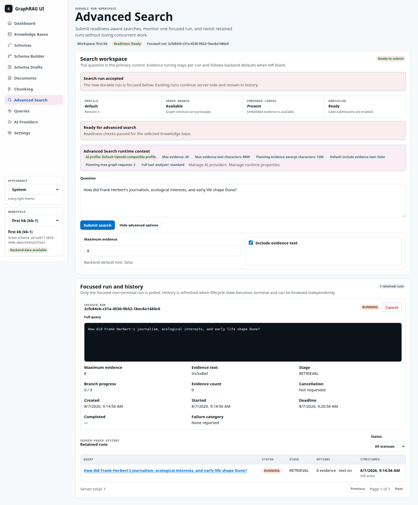

## Result and trust model

The backend persists a version-one result envelope containing:

- Answer status, text, confidence, limitations, and claims.
- Ranked citable evidence entries.
- Context-only entries used during synthesis.
- Graph facts and their evidence/citation links.
- Answer diagnostics and complete pipeline diagnostics.

The frontend validates both the envelope and nested payload version. Unsupported or mismatched versions are not coerced. Malformed version-one data stops semantic rendering and exposes raw JSON so broken references are not presented as trustworthy evidence.

Each evidence card can expose source filename and type, chunk/document IDs, source and page ranges, processing and chunker revisions, rank, score, text, and a deep link into the Chunk Explorer.


## Verified live example: safe partial result

The screenshot run asked:

```text
How did Frank Herbert's journalism, ecological interests, and early life shape Dune?
```

It requested eight final evidence items with evidence text enabled. The observed run used a live deadline override of 360 seconds and completed in about two minutes with this pipeline summary:

| Observation | Value |
| --- | --- |
| Plan | Safe fallback, one text subquery, zero graph requests |
| Round 1 | Dense 10 candidates; lexical 0; metadata 0 |
| Sufficiency | Partial coverage, concrete gap, two refinements |
| Round 2 | Dense 20 candidates; lexical 0; metadata 0 |
| Fusion | 30 accepted dense contributions, 10 deduplicated candidates |
| Graph expansion | 10 seeds, 20 source rows, 15 attached facts |
| Parent context | 8 evidence considered, 4 contexts, 3,610 estimated tokens |
| Rerank | 10 candidates, no fallback |
| Diversity | 6 selected items; 4 skipped by per-document cap |
| Answer | Initial validation failed; repair failed; no claims published |
| Terminal state | `PARTIAL`, failure category `REPAIR_FAILED`, 6/6 attempts completed |

This is a useful safety example: retrieval succeeded and evidence remained inspectable, but the system did not convert invalid model output into a trusted answer.

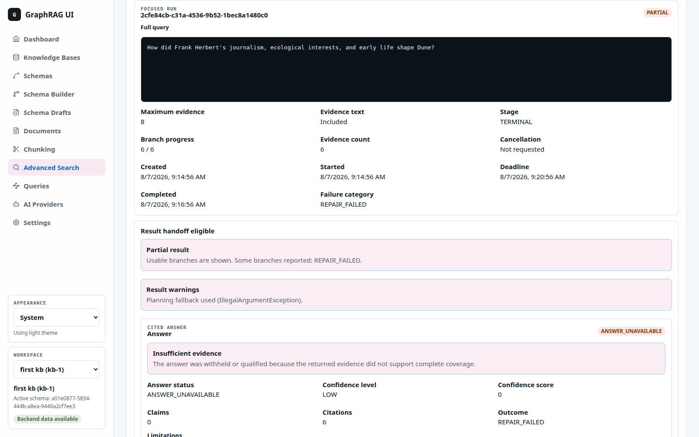

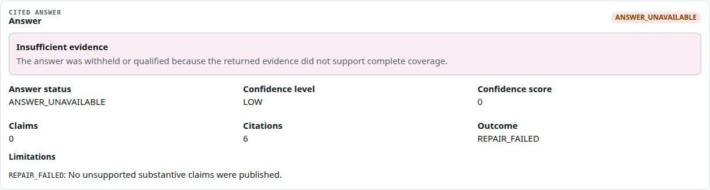


## Runtime configuration overview

Most search behavior is controlled through `app.advanced-search.*` runtime settings. Executor sizes and the full-text analyzer require restart; planning, evidence, deadline, follow-up, and retention settings apply live to newly admitted runs. Every run keeps its admitted settings snapshot, so later edits do not change that run.

The running environment matched source defaults except `deadline-seconds`, which was overridden from 60 to 360 seconds.

| Area | Important settings | Current effective values |
| --- | --- | --- |
| Admission | concurrency, queue capacity, branch concurrency | 2, 50, 4 |
| Deadline and retention | deadline, synthesis reserve, retention | 360 s live override, 10 s, 24 h |
| Final evidence | default, maximum, include text default, text budget | 10, 20, false, 8,000 characters |
| Retrieval pools | per-branch candidate limit, maximum guardrail, rerank pool | 60, 200, 20 |
| Graph enrichment | expansion seeds and facts | 10, 20 |
| Planning | subqueries, exact terms, graph plans, string limit | 3, 8, 2, 1,000 characters |
| Evaluation/follow-up | evaluation evidence, excerpt size, follow-up queries, minimum remaining | 10, 1,200 characters, 2, 5 s |

See [Advanced Search Reference](reference.md#runtime-settings) for every key, constraint, update mode, and direct consumer.

## Current implementation notes

These points are important when interpreting the current UI and API:

1. The frontend initializes **Include evidence text** to checked and always serializes a boolean. The backend default is currently false, but the UI's initial request therefore explicitly sends true unless the operator unchecks it.
2. The Maximum evidence helper currently displays `Backend default hint: false` in the running UI. Its loose key matching selects `default-include-evidence-text` before `default-evidence`; the actual backend evidence default is 10.
3. The run's `completedBranches` and evidence count are persisted after processing completes, not after each individual branch. During a running stage the UI can therefore show `0 / 3` even after internal retrieval work has advanced.
4. `includeEvidenceText=true` is a request, not an unlimited guarantee. The result's aggregate evidence/context text is trimmed to `max-evidence-text-characters`; later entries can retain provenance with empty text.
5. Advanced Search currently constructs parent-context limits directly from the per-run evidence maximum plus fixed bounds of three per document, 4,096 tokens, and one adjacent chunk. The general `app.query.parent-context-*` catalog settings are not read by this advanced-search ranking path.
6. `app.advanced-search.max-candidates` is a validation ceiling for `candidate-limit`; the processor uses `candidate-limit` as its direct branch and fusion bound.
7. Graph expansion can attach facts to text candidates even when the planner emitted no direct graph query. Those attached facts are not necessarily published as top-level graph facts unless the final catalog and answer references retain them.

## Source map

Backend repository: `/home/vitaliy/workspace/graphrag`

Frontend repository: `/home/vitaliy/workspace/graphrag-ui`

| Concern | Primary implementation |
| --- | --- |
| Frontend page, readiness, focused run, history | `src/features/advanced-search/AdvancedSearchPage.tsx` |
| Frontend result rendering and reference checks | `src/features/advanced-search/AdvancedSearchResult.tsx` |
| Frontend API, polling, result parsing | `src/api/advancedSearch.ts` |
| Backend REST contract | `src/main/java/io/github/vfedoriv/graphrag/controller/AdvancedSearchRunController.java` |
| Durable run admission and lifecycle orchestration | `src/main/java/io/github/vfedoriv/graphrag/service/AdvancedSearchRunService.java` |
| End-to-end processing pipeline | `src/main/java/io/github/vfedoriv/graphrag/service/DefaultAdvancedSearchRunProcessor.java` |
| Planning and validation | `AdvancedSearchPlanner.java`, `AdvancedSearchPlanValidator.java` |
| Retrieval | `DenseTextRetriever.java`, `LexicalTextRetriever.java`, `DocumentMetadataTextRetriever.java`, `AdvancedSearchGraphRetriever.java` |
| Ranking | `AdvancedSearchRankingPipeline.java` and its fusion, expansion, reranking, and diversity services |
| Sufficiency and follow-up | `AdvancedSearchSufficiencyEvaluator.java`, `AdvancedSearchFollowUpPolicy.java` |
| Answer safety | `AdvancedSearchAnswerSynthesizer.java`, `AdvancedSearchAnswerValidator.java` |
| Runtime configuration | `RuntimeSettingsService.java`, `AdvancedSearchProperties.java`, `application.properties` |
