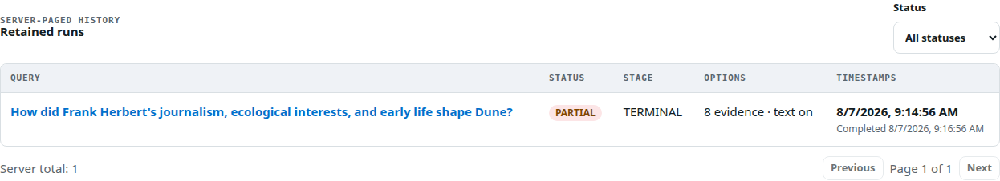
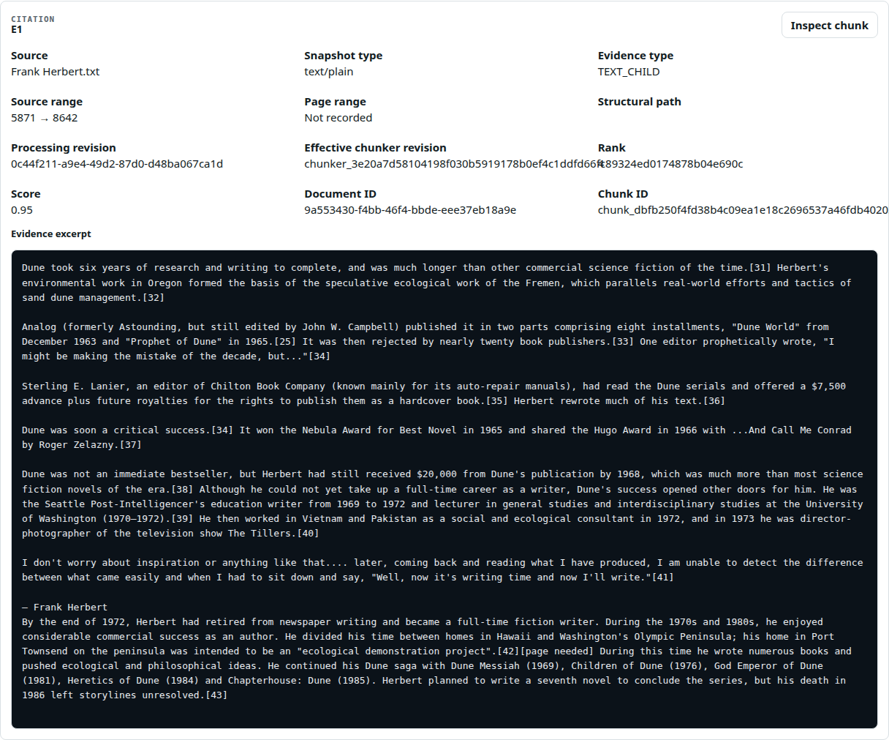
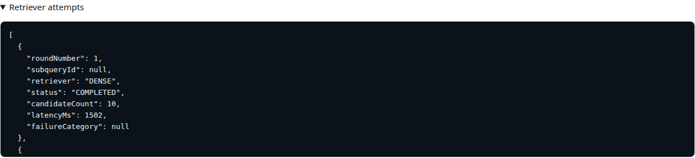

# Advanced Search Reference

This reference supplements [Advanced Search Strategy and Flow](README.md) with exact routes, request/response contracts, lifecycle rules, runtime settings, ranking constants, diagnostics, examples, and implementation locations.

## API base

All routes are scoped to one knowledge base:

```text
/api/v1/knowledge-bases/{knowledgeBaseId}/queries/advanced-search-runs
```

| Method and route | Success | Purpose |
| --- | --- | --- |
| `GET .../readiness` | 200 | Evaluate deterministic admission readiness |
| `POST ...` | 202 | Create and queue a durable run |
| `GET ...?status=&page=&size=` | 200 | List owned runs with optional status filter |
| `GET .../{runId}` | 200 | Poll owned run detail |
| `GET .../{runId}/result` | 200 | Read a persisted result for `COMPLETED` or `PARTIAL` |
| `POST .../{runId}/cancel` | 200 | Request idempotent cancellation |

Ownership is enforced by `knowledgeBaseId + runId`. An unknown or differently owned run is returned as not found.

### Readiness response

```json
{
  "knowledgeBaseId": "kb-1",
  "ready": true,
  "profileId": "default",
  "profileRevision": 6,
  "graphBranchAvailable": true,
  "embeddedCorpusPresent": true,
  "blockers": [],
  "informational": []
}
```

Readiness is advisory and submission is still protected transactionally. A profile change or new blocker between the check and create returns HTTP 409 with machine-readable issues.

### Create request

```json
{
  "query": "When does the Acme agreement renew?",
  "maximumEvidence": 10,
  "includeEvidenceText": true
}
```

| Field | Required | Validation and default |
| --- | --- | --- |
| `query` | Yes | Nonblank after trim; at most the effective `max-query-length`, hard ceiling 4,000 |
| `maximumEvidence` | No | Backend default 10; from 1 through effective maximum, hard ceiling 20 |
| `includeEvidenceText` | No | Backend default false; current frontend always sends a boolean and initially sends true |

The frontend omits `maximumEvidence` when the field is blank. It converts string input to a number before sending.

### Accepted run detail

```json
{
  "id": "run-123",
  "knowledgeBaseId": "kb-1",
  "query": "When does the Acme agreement renew?",
  "maximumEvidence": 10,
  "includeEvidenceText": true,
  "status": "QUEUED",
  "stage": "QUEUED",
  "completedBranches": 0,
  "totalBranches": 3,
  "evidenceCount": 0,
  "cancellationRequested": false,
  "failureCategory": null,
  "deadlineAt": "2026-08-07T12:01:00Z",
  "createdAt": "2026-08-07T12:00:00Z",
  "startedAt": null,
  "completedAt": null,
  "links": {
    "self": "/api/v1/knowledge-bases/kb-1/queries/advanced-search-runs/run-123",
    "result": "/api/v1/knowledge-bases/kb-1/queries/advanced-search-runs/run-123/result",
    "cancel": "/api/v1/knowledge-bases/kb-1/queries/advanced-search-runs/run-123/cancel"
  }
}
```

List responses replace full `query` with a normalized `queryPreview` limited to 160 Unicode code points.

### Paging

`page` is zero-based. `size` must be from 1 through 100. The frontend requests 10 items and supports these status filters:

```text
QUEUED RUNNING COMPLETED PARTIAL FAILED CANCELLED INTERRUPTED
```



## Error behavior

| HTTP status | Typical case | Frontend handling |
| --- | --- | --- |
| 400 | Invalid query/evidence bound or paging | Normalized problem detail |
| 404 | Knowledge base or owned run not found | Stale focused `runId` is cleared; draft and history remain |
| 409 | Readiness changed, profile changed, or result not persisted yet | Readiness refresh on create; 1.5 s result retry only after eligible terminal state |
| 429 | Executor + queue admission capacity exhausted | Draft, focus, and history remain; operator can retry later |

The result query disables TanStack Query's ordinary retry behavior. It retries only a 409 every 1.5 seconds, which covers the short race between terminal status visibility and result persistence.

## Status and stage semantics

### Status

| Status | Terminal | Result eligible | Meaning |
| --- | --- | --- | --- |
| `QUEUED` | No | No | Persisted and awaiting worker claim |
| `RUNNING` | No | No | Claimed by a worker |
| `COMPLETED` | Yes | Yes | Answered and every planned attempt completed successfully |
| `PARTIAL` | Yes | Yes | Persisted evidence/result exists, but answer or one or more branches were incomplete |
| `FAILED` | Yes | No | Deadline or unhandled processing failure prevented a result |
| `CANCELLED` | Yes | No | Cancellation stopped the run before result persistence |
| `INTERRUPTED` | Yes | No | Backend restart converted an active run to immutable terminal history |

### Stage

| Stage | Meaning |
| --- | --- |
| `QUEUED` | Awaiting worker claim |
| `RETRIEVAL` | Initial or follow-up retrieval |
| `RANKING` | Fusion, enrichment, reranking, or selection |
| `SYNTHESIS` | Citation catalog and answer generation/repair |
| `TERMINAL` | Immutable final state |

`completedBranches` is not updated branch by branch. Attempts are saved after the processor returns, and final completion writes `completedBranches = attempts.size()`. Treat running branch progress as planned scope, not real-time telemetry.

## Admission, execution, and recovery

### Capacity

```text
admission permits = concurrency + queueCapacity = 2 + 50 = 52 by source default
```

The semaphore is fair. A permit is reserved before run creation and released on terminal processing, queued cancellation, or dispatch failure. The task executor separately has two workers and a queue capacity of 50.

### Branch executor

The branch executor default concurrency is four. One text round submits exactly three tasks: dense, lexical, and metadata. Answer synthesis also uses the branch executor to enforce the remaining deadline around model calls.

### Restart and cleanup

At application startup, every active run is made `INTERRUPTED` with failure category `APPLICATION_RESTART`, evidence count zero, and a new expiry timestamp. Work is not resumed from a stage checkpoint.

Cleanup runs with a default fixed delay of 300,000 ms and deletes expired records in batches of `cleanup-batch-size`, currently 100.

## Snapshotted execution context

Creation stores:

- Effective advanced-search settings JSON.
- Active AI profile ID and revision.
- Active schema ID, content hash, and schema JSON when present.
- Requested maximum evidence and text-inclusion flag.
- Absolute deadline, creation time, and knowledge-base ownership.

The in-process worker receives the same admitted settings object. Profile-scoped model calls use the snapshotted profile ID. Graph planning and validation use the snapshotted schema rather than a later active schema. Because restarts interrupt active runs, no reconstruction from a stored settings snapshot is currently required.

## Planning contract

Effective default bounds:

| Plan field | Default maximum | Hard validation ceiling |
| --- | ---: | ---: |
| Text subqueries | 3 | 3 |
| Exact terms | 8 | 16 |
| Typed graph requests | 2 | 2 |
| One planned string | 1,000 characters | 2,000 and no more than query maximum |
| Schema prompt summary | 12,000 characters | Fixed implementation bound |

Planner output version is 1 and prompt revision is `advanced-search-planner-v1`.

Validation rejects unknown schema labels, relationship types, properties, projections, invalid hops/limits, executable content, duplicated/invalid identifiers, and count or length overflow. Fallback produces a bounded text plan and records the sanitized failure category.

## Text retrieval contracts

### Dense

1. Skip safely when no subqueries or embedded chunks exist.
2. Resolve the knowledge base's active snapshotted profile context.
3. Verify the stored embedding space is compatible.
4. Embed all subquery texts in one provider call.
5. Ensure the knowledge-base/embedding-space vector index.
6. Query up to `candidate-limit` rows per subquery.

### Lexical

1. Ensure the knowledge-base full-text index is online before the deadline.
2. Compile every subquery through the server-owned Lucene compiler.
3. Query up to `candidate-limit` rows per subquery.

The full-text analyzer is `standard` by default and is restart-bound because index infrastructure depends on it.

### Metadata

The planner can constrain `filename` and `contentType`. The retriever finds matching owned documents, then loads up to `candidate-limit` chunks. Without a metadata constraint, the branch completes successfully with zero candidates.

### Attempt record

```json
{
  "roundNumber": 1,
  "subqueryId": "q1",
  "retriever": "DENSE",
  "status": "COMPLETED",
  "candidateCount": 10,
  "latencyMs": 1502,
  "failureCategory": null
}
```

When a safe fallback plan is used, the observed text attempt `subqueryId` can be null.

## Graph retrieval contract

Graph plans are typed data, never model-authored Cypher. The backend:

1. Validates the plan against the snapshotted active schema.
2. Applies the run's remaining deadline, validated timeout, and row limit.
3. Renders Cypher through `GraphPlanCypherRenderer`.
4. Executes through `GraphRetrievalRepository`.
5. Keeps only facts with canonical IDs, schema identity, and valid parent-chunk support.

Valid parent citations require evidence ID, parent chunk ID, document ID, processing run ID, and valid source/page ranges when present. Unsupported or malformed rows are discarded.

Graph plan count adds to `totalBranches`. Graph attempts are named `graph-1`, `graph-2`, and so on.

## Fusion and ranking constants

| Constant | Value |
| --- | ---: |
| Reciprocal-rank denominator `RRF_K` | 60 |
| Maximum fusion pool | 60 |
| Maximum graph expansion seeds | 10 |
| Maximum graph-derived candidates | 20 |
| Maximum AI rerank pool | 20 |
| Default final evidence | 10 |
| Maximum final evidence | 20 |
| Default per-document cap | 3 |

### Fusion identity and score

Text and graph evidence are deduplicated by chunk ID. At most one contribution is retained for a channel/subquery pair, choosing the best raw rank.

```text
RRF(candidate) = sum over unique channel/subquery contributions:
  weight(channel) / executedQueries(channel) / (60 + rawRank)
```

Current processor requests equal weights through an empty weight map. Channel raw scores are retained for diagnostics but do not directly enter the fusion equation.

Example with one dense rank 1 and one lexical rank 4, with one executed query in each channel:

```text
score = 1 / (60 + 1) + 1 / (60 + 4)
      = 0.016393 + 0.015625
      = 0.032018
```

If three dense subqueries executed, a dense contribution is divided by 3 before entering the sum.

### Graph expansion

The top `graph-expansion-seed-limit` candidates are used as seeds. The repository returns supported facts, which are merged by canonical fact ID and attached to their seed candidates up to the fact budget.

### Parent context

Current Advanced Search passes these options directly:

```text
maxEvidence             = requested maximum evidence
maxContexts             = requested maximum evidence
maxContextsPerDocument  = 3
maxTokens               = 4096
adjacentChunks          = 1
includeText             = per-run includeEvidenceText
```

Valid recursive parents are preferred. When a child has no valid parent, bounded adjacent chunks can form an `ADJACENT` context. Contexts are deduplicated and subject to total, per-document, and token budgets.

The general `app.query.parent-context-*` settings happen to contain similar defaults but are not read by `DefaultAdvancedSearchRunProcessor.rank()`.

### Reranking

The AI reranker receives at most 20 fused candidates and at most 1,200 characters of text or parent context per candidate. It must score every ID exactly once in the range 0.0 through 1.0. Invalid output, no model, or an empty pool falls back deterministically to fused order.

### Diversity selection

Final selection walks reranked order until the requested maximum is reached. It skips candidates once a document has contributed three items. Comparison policy exists in the selector but the current processor always passes `false`, so the three-item cap is active.

## Sufficiency and follow-up

Sufficiency output version is 1 and prompt revision is `advanced-search-sufficiency-v1`. It must include exactly one coverage entry for every planned subquery, use only known evidence IDs, and keep contradictions and refinements within bounds.

Coverage statuses are `COMPLETE`, `PARTIAL`, and `MISSING`. With no evidence, the deterministic fallback marks every subquery missing, emits a concrete `NO_EVIDENCE` gap, and proposes bounded follow-ups. Provider or validation failure uses partial coverage with no concrete gap, preventing speculative extra retrieval.

Follow-up skip categories include:

- `CANCELLED`
- `NO_CONCRETE_GAP`
- `DEADLINE_RESERVE`
- `NO_REFINEMENTS`

When executed, round two runs dense, lexical, and metadata branches for up to two refinements and re-ranks all accumulated text results together with the original graph result.

## Answer and citation contract

Answer statuses include `ANSWERED`, `INSUFFICIENT_EVIDENCE`, and `ANSWER_UNAVAILABLE`. A result includes:

```json
{
  "payloadVersion": 1,
  "answer": {
    "version": 1,
    "status": "ANSWERED",
    "text": "The agreement renews on 31 January 2027.",
    "confidence": { "level": "HIGH", "score": 0.91 },
    "limitations": [],
    "claims": [
      {
        "id": "C1",
        "kind": "TEXT",
        "text": "The agreement renews on 31 January 2027.",
        "citationIds": ["E1"],
        "graphFactIds": [],
        "graphEvidenceIds": []
      }
    ]
  },
  "evidence": [],
  "contexts": [],
  "graphFacts": [],
  "answerDiagnostics": {},
  "diagnostics": {}
}
```

Citation rules:

- `TEXT` claims cite only known text-child `E` entries.
- `GRAPH` claims cite graph-parent `E` entries and known graph fact plus graph evidence IDs.
- `CTX` entries are context only and never citable.
- Every substantive claim must have valid support.
- Contradictions are preserved as limitations instead of silently resolved.

If validation fails, one repair attempt is allowed when at least two seconds remain. A failed repair returns an abstention with no claims.

## Result envelope and frontend validation

The REST response wraps the nested result:

```json
{
  "runId": "run-123",
  "payloadVersion": 1,
  "result": { "payloadVersion": 1 },
  "createdAt": "2026-08-07T12:00:30Z"
}
```

The frontend requires:

- A strict envelope with exactly the expected fields.
- Outer and nested payload versions both equal to 1.
- Envelope `runId` equal to the focused run.
- A complete Zod-validated version-one result shape.
- Known claim, citation, graph-fact, and graph-evidence references before trustworthy rendering.

Unsupported versions and malformed data retain raw JSON and stop semantic rendering.

### Evidence entry

| Field | Meaning |
| --- | --- |
| `citationId` | Public `E#` or context `CTX#` identifier |
| `type` | `TEXT_CHILD`, `GRAPH_PARENT`, or `CONTEXT_ONLY` |
| `chunkId`, `documentId` | Stable source ownership |
| `range` | Source character and page bounds when recorded |
| `processingRunId` | Processing snapshot that produced the chunk |
| `effectiveChunkerRevision` | Chunking policy identity |
| `structuralPath` | Parsed location when available |
| `text` | Optional and globally budgeted |
| `rank`, `score` | Final public ordering metadata |
| `sourceFilename`, `sourceContentType`, `sourceDisplayLabel` | Citation display metadata |

The result codec trims public evidence and context text against one aggregate `max-evidence-text-characters` budget. Empty text can therefore appear even when the run requested evidence text.



## Diagnostics

| Group | Representative fields |
| --- | --- |
| Plan | version, prompt revision, counts, metadata constrained, fallback |
| Sufficiency | complete/partial/missing coverage, contradictions, gap, refinements, fallback |
| Follow-up | executed, query count, skip category |
| Attempts | round, subquery, retriever, status, candidate count, latency, failure |
| Fusion | accepted/truncated by channel, executed queries, deduplicated pool, graph-derived count |
| Graph expansion | seeds, source rows, attached facts |
| Parent context | evidence considered, context count, token estimate, outcomes |
| Rerank | pool size and fallback |
| Selection | requested maximum, document cap, skipped count, selected by document |
| Source metadata | warnings |
| Answer | repair attempted/succeeded, abstention, citation/claim counts, outcome |

All diagnostic failure categories are sanitized and bounded before persistence or observability tagging.



## Runtime settings

Values below are source defaults. The running environment had one verified override: `deadline-seconds=360`.

| Key suffix under `app.advanced-search` | Default | Constraints / mode | Direct effect |
| --- | ---: | --- | --- |
| `concurrency` | 2 | >=1, restart | Run worker count and admission permits |
| `queue-capacity` | 50 | >=1, restart | Executor queue and admission permits |
| `branch-concurrency` | 4 | >=1, restart | Text branches and bounded synthesis calls |
| `full-text-analyzer` | `standard` | nonblank, restart | Lexical index analyzer |
| `deadline-seconds` | 60 | >=1, live | Absolute deadline on newly admitted runs |
| `default-evidence` | 10 | >=1 and <= max, live | Missing request value |
| `default-include-evidence-text` | false | boolean, live | Missing API request value |
| `max-evidence` | 20 | 1..20, live | Per-run final evidence ceiling |
| `candidate-limit` | 60 | >=1 and <= max-candidates, live | Per-subquery branch limit and fusion pool bound |
| `max-candidates` | 200 | candidate-limit..200, live | Validation ceiling; not a separate processor pool |
| `rerank-pool-size` | 20 | <= candidate-limit and <=20, live | AI rerank pool |
| `graph-expansion-seed-limit` | 10 | 0..10, live | Candidates used as fact-expansion seeds |
| `graph-expansion-fact-limit` | 20 | 0..20, live | Graph-derived/fact budget |
| `max-query-length` | 4000 | 1..4000, live | Submitted question bound |
| `max-evidence-text-characters` | 8000 | >=0, live | Aggregate public evidence/context text budget |
| `planning-max-subqueries` | 3 | 1..3, live | Planner text decomposition |
| `planning-max-exact-terms` | 8 | 0..16, live | Planner exact terms |
| `planning-max-graph-requests` | 2 | 0..2, live | Planner graph request count |
| `planning-max-string-characters` | 1000 | <=2000 and <= query max, live | Planned string bound |
| `planning-evaluation-evidence-limit` | 10 | <= max evidence and <=20, live | Evidence exposed to sufficiency evaluation |
| `planning-evidence-excerpt-characters` | 1200 | 1..4000, live | Sufficiency excerpt bound |
| `follow-up-max-queries` | 2 | 0..2, live | Refinement count |
| `follow-up-minimum-remaining-seconds` | 5 | >=0, live | Follow-up time gate |
| `synthesis-reserve-seconds` | 10 | >=0 and reserves fit deadline, live | Time protected for final answer |
| `retention-hours` | 24 | >=1, live | Terminal record expiry |
| `cleanup-batch-size` | 100 | >=1, live | Expired-record deletion batch |

Executor settings and analyzer are configured through `AdvancedSearchProperties`; the remaining values are resolved through `RuntimeSettingsService` and stored in `AdvancedSearchSettings`.

### Legacy hybrid keys

The runtime service recognizes these as legacy settings:

```text
app.query.hybrid-search-default-top-k
app.query.hybrid-search-max-top-k
app.query.hybrid-search-candidate-multiplier
app.query.hybrid-search-max-candidates
app.query.hybrid-search-default-graph-depth
app.query.hybrid-search-max-graph-depth
app.query.hybrid-search-include-chunk-text
```

Defined equivalents are:

| Legacy key | Current key |
| --- | --- |
| `app.query.hybrid-search-max-candidates` | `app.advanced-search.max-candidates` |
| `app.query.hybrid-search-include-chunk-text` | `app.advanced-search.default-include-evidence-text` |

These aliases do not restore the removed hybrid-search route or frontend tab.

## Frontend behavior details

| Behavior | Implementation |
| --- | --- |
| Readiness and history scope | Selected knowledge base |
| Focus identity | `runId` query parameter |
| Poll interval | 1.5 seconds for focused non-terminal run only |
| Result eligibility | `COMPLETED` and `PARTIAL` only |
| History page size | 10 |
| History refresh | Create/cancel mutation and focused terminal transition |
| Knowledge-base change | Clear focus, reset history page, remove old advanced-search cache |
| Stale/foreign run | Clear focus, preserve question/options/history |
| Result parse failure | Stop semantic rendering and retain raw JSON |
| Evidence navigation | Deep link to `/chunking?view=chunks&documentId=...&chunkId=...` |

## Verified UI caveats

### Incorrect maximum-evidence default hint

`getEvidenceHints()` selects the first advanced-search key containing both `default` and `evidence`. With the running API order it finds `app.advanced-search.default-include-evidence-text`, so the Maximum evidence control displays:

```text
Backend default hint: false
```

The actual backend default maximum evidence count is 10.

### Evidence-text default mismatch

The backend default is false, but frontend state initializes `includeEvidenceText` to true and the serializer applies `?? true`. Every current UI submission therefore sends an explicit value; leaving the form untouched sends true.

### Non-incremental branch progress

Attempts and evidence count are committed at terminal completion. During retrieval the UI can show `0 / 3` and zero evidence even after internal branches have returned. Stage is the reliable running progress indicator.

## Implementation map

Backend repository: `/home/vitaliy/workspace/graphrag`

| Concern | File |
| --- | --- |
| REST routes and OpenAPI examples | `src/main/java/io/github/vfedoriv/graphrag/controller/AdvancedSearchRunController.java` |
| Readiness | `service/AdvancedSearchReadinessService.java` |
| Admission semaphore | `service/AdvancedSearchAdmission.java` |
| Executors | `config/AdvancedSearchConfiguration.java`, `config/AdvancedSearchProperties.java` |
| Run persistence/orchestration | `service/AdvancedSearchRunService.java` |
| Lifecycle invariants | `service/AdvancedSearchRunLifecycle.java` |
| Restart and cleanup | `service/AdvancedSearchRunMaintenance.java` |
| Main pipeline | `service/DefaultAdvancedSearchRunProcessor.java` |
| Planner | `service/AdvancedSearchPlanner.java`, `service/AdvancedSearchPlanValidator.java` |
| Dense retrieval | `service/DenseTextRetriever.java` |
| Lexical retrieval | `service/LexicalTextRetriever.java`, `service/LuceneQueryCompiler.java` |
| Metadata retrieval | `service/DocumentMetadataTextRetriever.java` |
| Graph retrieval | `service/AdvancedSearchGraphRetriever.java` |
| Fusion | `service/AdvancedSearchFusionService.java` |
| Enrichment | `service/AdvancedSearchGraphExpansionService.java`, `service/AdvancedSearchParentContextService.java` |
| Reranking and diversity | `service/AdvancedSearchReranker.java`, `service/AdvancedSearchDiversitySelector.java` |
| Sufficiency/follow-up | `service/AdvancedSearchSufficiencyEvaluator.java`, `service/AdvancedSearchFollowUpPolicy.java` |
| Synthesis/validation | `service/AdvancedSearchAnswerSynthesizer.java`, `service/AdvancedSearchAnswerValidator.java` |
| Result codec and DTOs | `service/AdvancedSearchResultCodec.java`, `dto/AdvancedSearchResultDtos.java` |
| Runtime settings | `service/RuntimeSettingsService.java`, `src/main/resources/application.properties` |

Frontend repository: `/home/vitaliy/workspace/graphrag-ui`

| Concern | File |
| --- | --- |
| Workspace, submission, focused run, history | `src/features/advanced-search/AdvancedSearchPage.tsx` |
| Answer, claims, evidence, contexts, graph facts, diagnostics | `src/features/advanced-search/AdvancedSearchResult.tsx` |
| Result helper links and labels | `src/features/advanced-search/advancedSearchResultHelpers.ts` |
| API routes, serializer, polling, version parser | `src/api/advancedSearch.ts` |
| DTO types and diagnostic schema | `src/api/types.ts` |
| Stable query keys | `src/api/queryKeys.ts` |
| Router entry | `src/app/router.tsx` |
