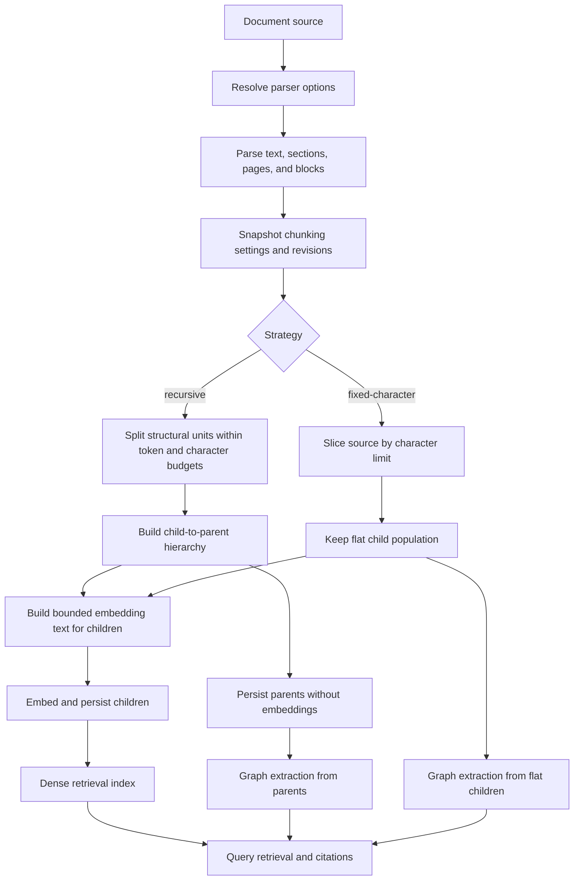
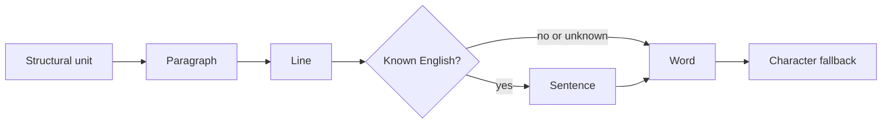
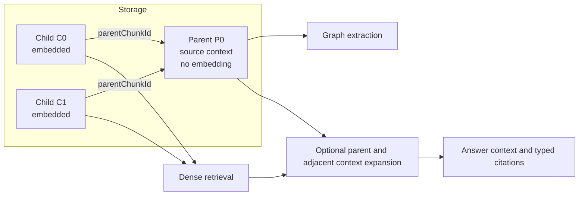
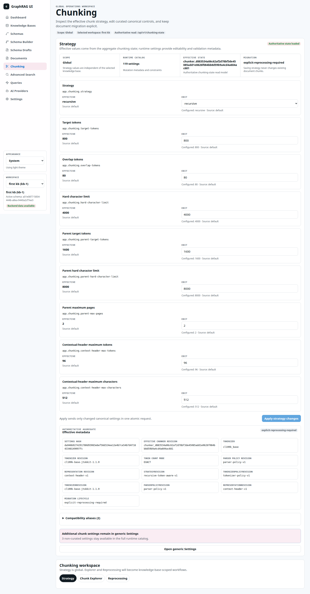
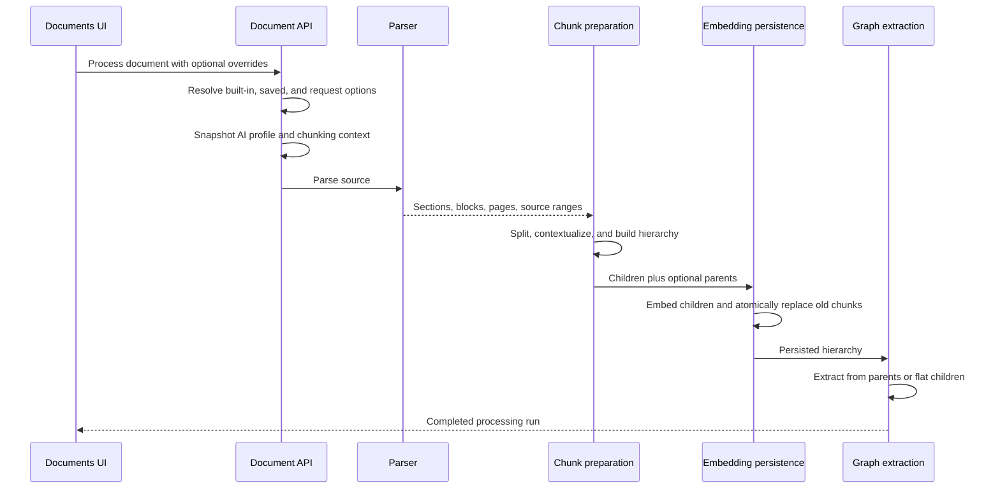
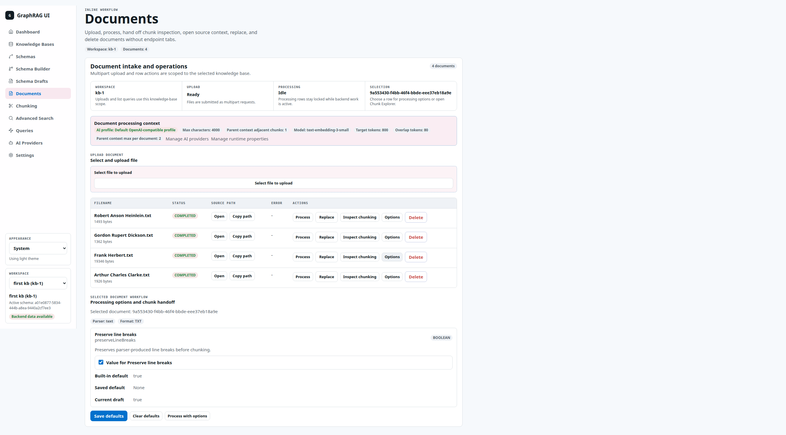
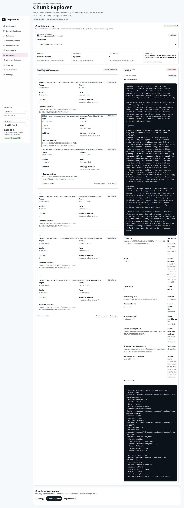
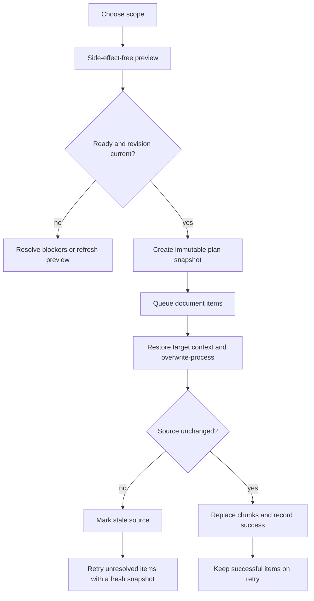
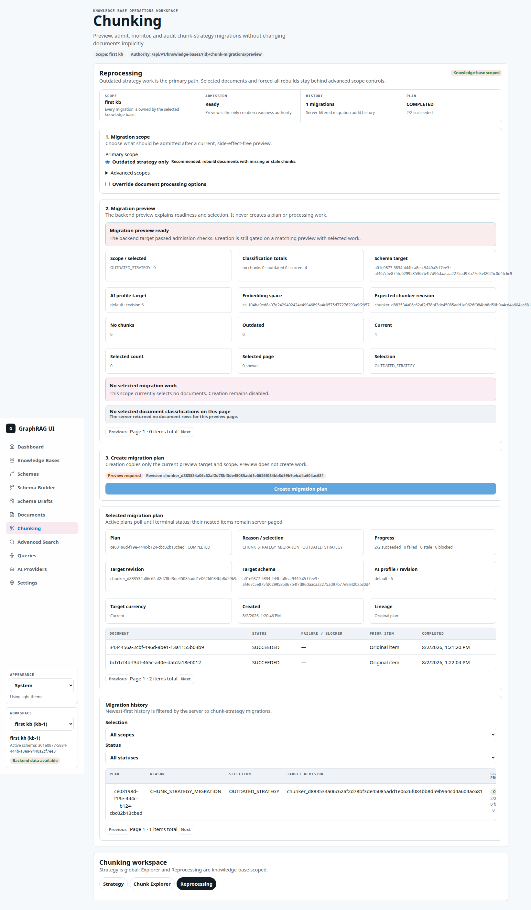

# Chunking Strategy and Lifecycle

This document explains how GraphRAG turns a parsed document into retrievable child chunks, optional parent chunks, contextualized embedding text, and graph-extraction input. It covers the backend implementation, frontend workflows, runtime configuration, revision tracking, and explicit reprocessing lifecycle as verified against the running applications on 2026-08-07.

For endpoint payloads, state machines, parser options, and a source-code map, see [Chunking Reference](reference.md).

## Executive summary

- Chunking happens after parsing and before embedding and graph extraction.
- `recursive` is the default and recommended strategy. It observes parsed structure, enforces token and character limits, produces child chunks, and groups compatible children into parent chunks.
- `fixed-character` is a compatibility strategy. It slices by character count and produces only flat child chunks.
- Only child chunks are embedded. Recursive parent chunks are used as broader graph-extraction and retrieval context.
- The stored chunk text is always the authoritative source slice. A bounded provenance header may be prepended only to the text sent for embedding.
- A chunk's effective revision identifies the exact strategy, settings, tokenizer, parser, and representation policy that produced it.
- Editing runtime settings does not rewrite existing chunks. Reprocessing is an explicit, previewed, revision-guarded operation.

## End-to-end flow



The processing pipeline takes an immutable settings snapshot before chunk preparation. A mid-run settings edit therefore cannot make one document internally inconsistent.

## Strategy comparison

| Behavior | `recursive` | `fixed-character` |
| --- | --- | --- |
| Primary boundary | Parsed structure, then increasingly smaller text units | Character offset |
| Limits | Token target and hard character limit | Hard character limit |
| Overlap | Trailing complete units within a token budget | A character count derived from `overlapTokens` |
| Language-aware sentence tier | Yes, for known English | No |
| Parent chunks | Yes | No |
| Child embeddings | Yes | Yes |
| Graph extraction input | Parents when available | Flat children |
| Intended use | Normal production strategy | Compatibility and deterministic character slicing |

### Recursive token-aware strategy

The recursive strategy starts from structural units emitted by the parser. Page, table, and table-cell blocks are not used as direct split boundaries, but their intervening text is retained through source ranges. If a unit is too large, it is split through this fallback order:



At every level, a candidate must fit both the source token budget and source character budget. The final character fallback also avoids cutting a UTF-16 surrogate pair.

Adjacent units are packed until the next unit would overflow a limit. When a chunk closes, complete trailing units may carry into the next chunk while they remain within the overlap budget. The strategy never copies a partial unit merely to hit the configured overlap exactly.

With the current defaults, header space is reserved before source splitting:

```text
source token budget     = 800 - 96  = 704 tokens
source character budget = 4000 - 512 = 3488 characters
overlap budget          = up to 80 tokens of complete units
```

The implementation also records diagnostics such as the deepest fallback tier, detected English status, structural unit count, actual overlap token count, and a LangChain4j reference-segment count. LangChain4j is used only as a diagnostic reference here; GraphRAG owns the authoritative boundaries and source offsets.

### Fixed-character strategy

The fixed strategy trims the input and creates slices no longer than `hardCharacterLimit`. It does not use `targetTokens` as its split boundary and does not create parents.

There is an important compatibility behavior: `overlapTokens` is treated as a character count by this strategy.

```text
hardCharacterLimit = 10
overlapTokens       = 3
source              = ABCDEFGHIJKLMNO

chunk 0 [0, 10) = ABCDEFGHIJ
chunk 1 [7, 15)  = HIJKLMNO
overlap           = HIJ (3 characters, not 3 tokenizer tokens)
```

This distinction matters when comparing the strategies or estimating storage growth.

## Parent and child hierarchy

Recursive child chunks from the same section are grouped into a parent while they have compatible structural paths and the aggregate source fits the parent token and character limits. A parent is materialized from authoritative source ranges rather than by concatenating transformed child text.

For PDFs, a parent may span two adjacent pages only when all of these are true:

- `parentMaxPages` permits two pages.
- The page numbers are adjacent.
- The structural path is the same and non-empty.
- Both sides have authoritative block confidence.
- The combined parent remains within its token and character limits.



Parents store `childCount`, cross-page status, and range-materialization diagnostics. Children store `parentChunkId`, `childIndex`, and `siblingCount`. Fixed-character output is persisted as children without parent links; API hierarchy responses report that population as `flatChunkCount`.

## Contextual embedding text

The source slice and embedding representation are intentionally separate:

- `text` is the authoritative source slice used for inspection and citation.
- `embeddingText` may prepend a bounded provenance header.
- Source offsets and hashes always describe the authoritative source slice.

The header builder tries fields in this order, stopping when token or character space is exhausted:

```text
[context-header-v1]
source: Frank Herbert.txt
format: TXT
path: Biography
page: 3

<authoritative source slice>
```

Whitespace is normalized and individual values are capped. If a safe header cannot fit, the embedding text is exactly the source text. Metadata records whether contextualization happened and the header and final embedding token counts.

## Token counting policy

Tokenizer choice belongs to the active AI profile and is captured in the chunking snapshot.

| Condition | Estimator | Mode | Revision |
| --- | --- | --- | --- |
| Explicit tokenizer `cl100k_base` | JTokkit CL100K | Exact | `cl100k-base-jtokkit-1.1.0` |
| Known OpenAI embedding model (`text-embedding-ada-002`, `text-embedding-3-small`, or `text-embedding-3-large`) | JTokkit CL100K | Exact | `cl100k-base-jtokkit-1.1.0` |
| Unknown embedding model without an explicit tokenizer | UTF-8 byte count | Conservative | `utf8-byte-v1` |

An unsupported explicit tokenizer is rejected instead of silently changing the counting policy.

## Configuration

The Chunking > Strategy page edits the canonical construction settings. The running system currently uses these defaults:

| Setting | Default | Role |
| --- | ---: | --- |
| `app.chunking.strategy` | `recursive` | Selects the strategy |
| `app.chunking.target-tokens` | `800` | Target child token limit for recursive splitting |
| `app.chunking.overlap-tokens` | `80` | Recursive complete-unit overlap budget; fixed compatibility overlap in characters |
| `app.chunking.hard-character-limit` | `4000` | Hard child source/representation character limit |
| `app.chunking.parent-target-tokens` | `1600` | Parent token limit |
| `app.chunking.parent-hard-character-limit` | `8000` | Parent character limit |
| `app.chunking.parent-max-pages` | `2` | Maximum pages represented by one parent; valid values are 1 or 2 |
| `app.chunking.context-header-max-tokens` | `96` | Token space reserved for an embedding header |
| `app.chunking.context-header-max-characters` | `512` | Character space reserved for an embedding header |

`app.chunking.representation-revision` is deployment-owned and read-only; it is currently `context-header-v1`. The legacy aliases `max-tokens` and `max-characters` remain visible for compatibility, while canonical overrides take precedence.

The `app.query.parent-context-*` settings shown elsewhere control retrieval-time context expansion. They do not alter chunk boundaries or hierarchy construction.

### Strategy UI

The Strategy page combines the editable runtime catalog with the backend's authoritative chunking-state snapshot. Saving sends only changed canonical settings in one bulk update and then refreshes both views.



## Revision and identity model

Every processing run records enough provenance to explain and reproduce its boundaries:

```text
settingsHash = SHA-256(canonical sorted effective settings)

effectiveChunkerRevision = SHA-256(
  settingsHash
  + strategyRevision
  + tokenizerRevision
  + parserRevision
  + representationRevision
)
```

Chunk IDs are also deterministic hashes of document content revision, strategy revision, chunk kind, section index, and source range. The same source and policy therefore produce stable IDs; changing content, policy revision, or boundaries produces different IDs.

Two revision scopes appear in the UI and API:

- The global chunking-state revision identifies the current policy using the parser-policy revision and tokenizer-policy revision. It protects migration admission against live configuration changes.
- A persisted document revision uses the actual parser and tokenizer selected for that document, such as `text-v1` and the CL100K estimator revision.

Different global and document revision values are expected; they answer different questions.

## Processing lifecycle



Parser options are resolved in this precedence order:

1. Parser built-in defaults.
2. Saved defaults for the document.
3. One-run request overrides.

Options such as line-break preservation, PDF page splitting, Tika spacing and sorting, OCR, and page limits can change the parsed source or structural hints before chunking. The chunking strategy never modifies the backend document contract from the frontend.

### Document processing options UI

The Documents page exposes saved parser defaults and process-with-options. These settings affect parsing before the global chunking policy is applied.



## Chunk Explorer

The Explorer is knowledge-base scoped and URL-addressable. It loads bounded hierarchy summaries, paged children, and one chunk's detail on demand instead of materializing every chunk in the browser. The detail panel exposes authoritative text, source offsets, strategy and tokenizer provenance, hierarchy fields, contextualization diagnostics, and raw metadata.



In the verified live example, a recursive text document has four parents and seven children, with no flat population.

## Explicit reprocessing and migration

Changing settings affects future processing only. Existing chunks remain readable until a user explicitly creates a reprocessing plan.



The recommended scope includes documents with no chunks and documents whose active completed processing run does not match the target revision. Advanced scopes allow explicit document IDs or every document, including current ones.

Preview can block creation when the active schema is missing, the AI profile cannot be resolved, the embedding space is incompatible, the target is invalid, or another destructive plan is active. Creation includes the preview's expected global revision; a concurrent settings change causes a `409` and forces a refresh instead of silently running against a different target.

Each plan stores an immutable snapshot of strategy, settings, tokenizer, schema, profile, embedding space, parser, and resolved document options. A document whose source changes before processing is marked stale rather than overwriting chunks for the wrong source revision.



## Operational guidance

- Use `recursive` for production retrieval unless a compatibility requirement specifically needs fixed character slices.
- Treat tokenizer, parser, and representation changes as chunk-policy changes even when the numeric settings stay the same.
- Preview the recommended reprocessing scope after changing any construction setting.
- Investigate readiness blockers before creating a plan; do not use `ALL` merely to bypass classification.
- Preserve the separation between construction settings and query-time parent-context expansion.
- Inspect source offsets and `sourceHash` when diagnosing citation or boundary issues. Inspect contextualization metadata when diagnosing embedding input.
- Expect storage and embedding volume to rise as child targets shrink or overlap rises. Recursive parents add records but not embedding calls.

## Known implementation gap

Verified on 2026-08-07: the frontend Chunk Explorer requests `kind=FLAT` when `flatChunkCount` is non-zero, while the backend bounded chunk endpoint accepts only `PARENT` or `CHILD`. Current live recursive documents have no flat population, so the normal view works, but a fixed-character or other flat population would receive HTTP 400 when the Explorer tries to load it.

The contract should be aligned before relying on Explorer inspection of fixed-character output. The least disruptive options are to have the frontend request unparented `CHILD` records using the supported filters, or to add an explicitly documented `FLAT` backend filter. This document does not change application behavior.

## Related documentation

- [Chunking Reference](reference.md) — validation rules, DTO concepts, endpoints, plan states, parser inputs, and source map.
- [Testing Gap Report](../testing-gap-report.md) — repository-wide frontend validation baseline.
